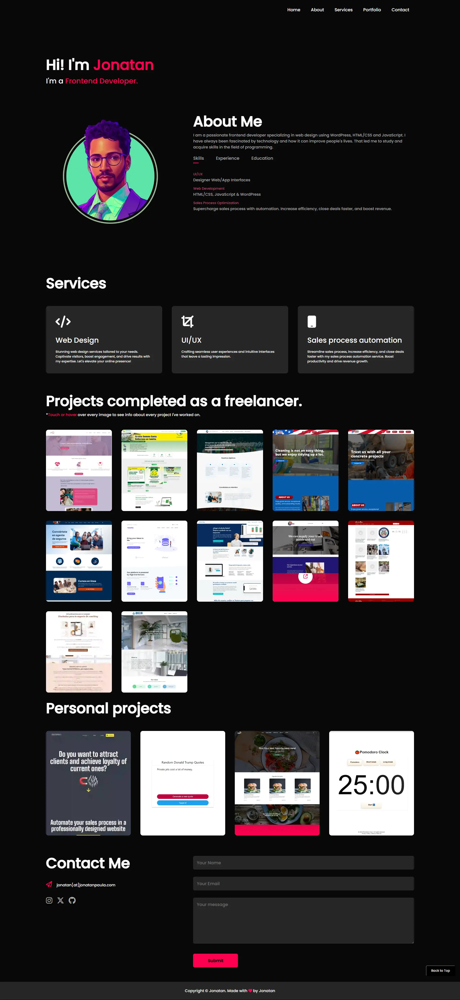

# My Portfolio

Welcome to my portfolio! This is a showcase of my web development journey where I've used JavaScript, HTML, and CSS to create a fantastic digital space to display my work and skills.

## Table of Contents
- [Demo](#demo)
- [Features](#features)
- [Technologies](#technologies)
- [Installation](#installation)
- [Usage](#usage)
- [Contributing](#contributing)
- [License](#license)

## Demo
You can check out my portfolio live <a href="jonatantech.github.io">here.</a>

## Features
- **Interactive Design**: A user-friendly interface with smooth navigation.
- **Project Showcase**: Display your web development projects with detailed descriptions.
- **Contact Information**: Easily reachable through contact details provided.
- **Responsive**: Works seamlessly on desktops, tablets, and mobile devices.

## Technologies
- HTML5
- CSS3
- JavaScript

## Installation
1. Clone this repository to your local machine.

2. Open the `index.html` file in your web browser to view the portfolio.

## Usage
- Replace the placeholder content in the `index.html` file with your own projects and details.
- Customize the CSS styles in the `styles.css` file to match your personal brand.

## Contributing
Feel free to contribute to the project by opening issues or submitting pull requests. Any contributions are highly appreciated!

## License
This project is licensed under the MIT License - see the [LICENSE](LICENSE) file for details.
